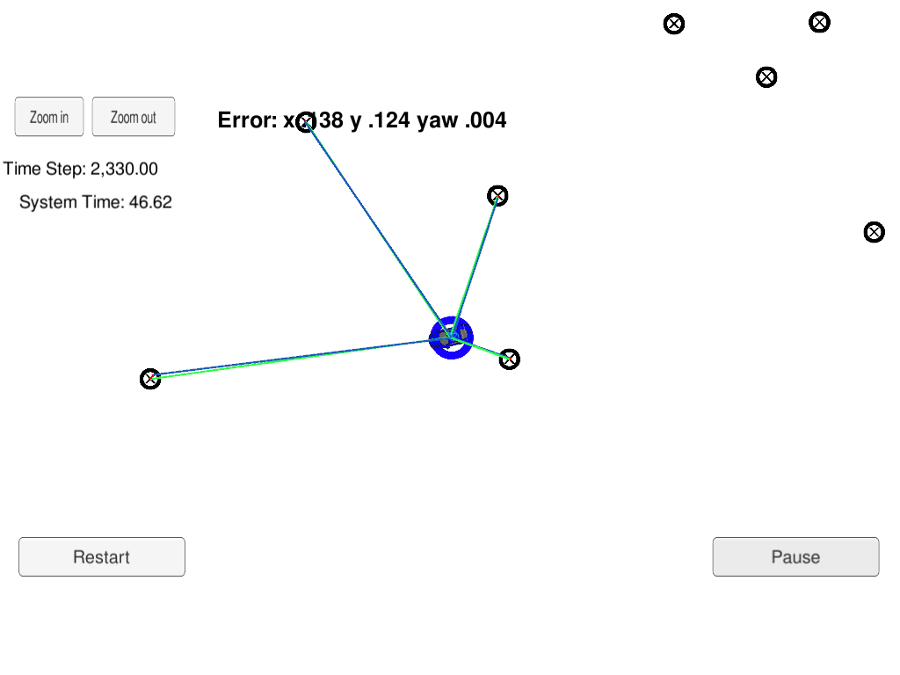

## README

### Technical Report for Localization through Particle Filter

---



The goals of this project are the following:

* Implement the **discretized Constant Turing Rate and Velocity Magnitude (CTRV)** motion model.
* Implement the **particle filter (PF)** based localization algorithm.
* Achieve the desired precision and efficiency on the given test dataset

---

### Algorithm Workflow

---

#### First Measurement Processing

For the first GPS measurement:

1. Particle swarm is initialized based on GPS measurement params.

```cpp
/**
 * Initializes particle filter by:
 *	1. initializing particles to Gaussian distribution around first GPS measurement
 *	2. Set all the weights to 1.
 * @param x Initial x position [m] (simulated estimate from GPS)
 * @param y Initial y position [m]
 * @param theta Initial orientation [rad]
 * @param std[] Array of dimension 3
 *	[
 *		standard deviation of x [m],
 *		standard deviation of y [m],
 *		standard deviation of yaw [rad]
 *	]
 */
void ParticleFilter::init(double x, double y, double theta, double std[]) {
	// Set up GPS measurement distributions:
	normal_distribution<double> dist_x(x, std[0]), dist_y(y, std[1]);
	normal_distribution<double> dist_theta(theta, std[2]);

	// Initialize particles:
	for (int i = 0; i < num_particles; ++i) {
		Particle particle;
		// Set id:
		particle.id = i;
		// Set location:
		particle.x = dist_x(random_gen); particle.y = dist_y(random_gen);
		// Set heading:
		particle.theta = dist_theta(random_gen);
		// Set weight:
		particle.weight = 1.0;

		particles.push_back(particle);
		weights.push_back(1.0);
	}

	is_initialized = true;
}
```

#### Predict

First, each particle's state is transfered according to deterministic control.

Here Constant Turing Rate and Velocity Magnitude(CTRV) model is used.

```cpp
/**
 * Apply deterministic control to given particle in place
 *
 * @param particle Particle instance
 * @param delta_t Time between time step t and t+1 in measurements [s]
 * @param velocity Velocity of car from t to t+1 [m/s]
 * @param yaw_rate Yaw rate of car from t to t+1 [rad/s]
 */
void ParticleFilter::predictionParticle(Particle &particle, double delta_t, double velocity, double yaw_rate) {
	// Deterministic control:
	if (abs(yaw_rate) < 1e-7) {
		// If no significant angular rotation:
		particle.x += velocity * delta_t * cos(particle.theta);
		particle.y += velocity * delta_t * sin(particle.theta);
	} else {
		// If there is significant angular rotation:
		double r = velocity / yaw_rate;

		particle.x += r * (+sin(particle.theta + yaw_rate * delta_t) - sin(particle.theta));
		particle.y += r * (-cos(particle.theta + yaw_rate * delta_t) + cos(particle.theta));
		particle.theta += yaw_rate * delta_t;
	}
}
```

After that, Gaussian actuation noise is added according to probabilistic assumption.

```cpp
/**
 * Predicts the state for the next time step using the CTRV process model.
 *
 * @param delta_t Time between time step t and t+1 in measurements [s]
 * @param std_pos[] Array of dimension 3:
 *		[
 *			standard deviation of x [m],
 *			standard deviation of y [m],
 *   		standard deviation of yaw [rad]
 *		]
 * @param velocity Velocity of car from t to t+1 [m/s]
 * @param yaw_rate Yaw rate of car from t to t+1 [rad/s]
 */
void ParticleFilter::prediction(double delta_t, double std_pos[], double velocity, double yaw_rate) {
	// Set up control noise distribution:
	normal_distribution<double> dist_x(0.0, std_pos[0]), dist_y(0.0, std_pos[1]);
	normal_distribution<double> dist_theta(0.0, std_pos[2]);

	// Add deterministic control and random noise to each particle:
	for (int i = 0; i < num_particles; ++i) {
		// Apply deterministic control:
		Particle &particle = particles[i];
		predictionParticle(particle, delta_t, velocity, yaw_rate);

		// Control noise:
		particle.x += dist_x(random_gen);
		particle.y += dist_y(random_gen);
		particle.theta += dist_theta(random_gen);
	}
}

```

#### Update

First, for each particle its observation-map correspondence is set up through nearest neighbor principle:

```cpp
/**
 * Set up observation-map correspondence for each particle using nearest neighbor rule
 *
 * @param particle Particle instance
 * @param observations Vector of landmark observations
 * @param map_landmarks Map class containing map landmarks
 */
void ParticleFilter::updateParticle(Particle &particle, const std::vector<LandmarkObs> &observations, const Map &map_landmarks) {
	// Set up rotation matrix:
	double R[2][2];
	R[0][0] = +cos(particle.theta); R[0][1] = -sin(particle.theta);
	R[1][0] = +sin(particle.theta); R[1][1] = +cos(particle.theta);

	// Set up translation vector:
	double t[2];
	t[0] = particle.x; t[1] = particle.y;

	// Transform vehicle frame observation to global frame:
	particle.sense_x.clear(); particle.sense_y.clear();
	for (const LandmarkObs &observation: observations) {
		particle.sense_x.push_back(R[0][0]*observation.x + R[0][1]*observation.y + t[0]);
		particle.sense_y.push_back(R[1][0]*observation.x + R[1][1]*observation.y + t[1]);
	}

	// Identify landmark association:
	const std::vector<Map::single_landmark_s> &landmarks = map_landmarks.landmark_list;
	particle.associations.clear();
	for (int i = 0; i < observations.size(); ++i) {
			double minDist = numeric_limits<double>::max();
			int minIdx = 0;

			// Identify the nearest landmark:
			for (int j = 0; j < landmarks.size(); ++j) {
				double dist = (
					pow(particle.sense_x[i] - landmarks[j].x_f, 2) + pow(particle.sense_y[i] - landmarks[j].y_f, 2)
				);

				if (dist < minDist) {
					minDist = dist;
					minIdx = j;
				}
			}

			particle.associations.push_back(minIdx + 1);
	}
}
```

After that, posterior probability is calculated based on square error between observation and its corresponding landmark.

Here particle with nearest landmark distance larger than sensor range will be filtered out directly to facilitate the evolution process:

```cpp
/**
 * Updates the weights for each particle based on the likelihood of the observed measurements.
 *
 * @param sensor_range Max valid sensor read [m]
 * @param std_landmark[] Array of dimension 2 [Landmark measurement uncertainty [x [m], y [m]]]
 * @param observations Vector of landmark observations
 * @param map Map class containing map landmarks
 */
void ParticleFilter::updateWeights(
	double sensor_range,
	double std_landmark[],
	const std::vector<LandmarkObs> &observations,
	const Map &map_landmarks
) {
	// Maximum square error:
	const double maxErr = pow(sensor_range, 2);
	const std::vector<Map::single_landmark_s> &landmarks = map_landmarks.landmark_list;

	// For each particle:
	for (int i = 0; i < num_particles; ++i) {
		Particle &particle = particles[i];

		// Set up measurement-map correspondence under particle pose:
		updateParticle(particle, observations, map_landmarks);

		// Calculate particle posterior:
		for (int j = 0; j < particle.associations.size(); ++j) {
			const double xSqrErr = pow(particle.sense_x[j] - landmarks[particle.associations[j] - 1].x_f, 2);
			const double ySqrErr = pow(particle.sense_y[j] - landmarks[particle.associations[j] - 1].y_f, 2);

			if (xSqrErr > maxErr || ySqrErr > maxErr || xSqrErr + ySqrErr > maxErr) {
				// Annihilate particle with invalid measurement:
				weights[i] = 0.0;
				break;
			} else {
				// Only calculate posterior for particle with all measurements valid:
				weights[i] *= getWeight(xSqrErr, ySqrErr, std_landmark);
			}
		}
	}
}
```

---

### Localization Accuracy

---

Algorithm performance on testing dataset is as follows:

|   State  |               Accuracy             |
|:--------:|:----------------------------------:|
|     x    |                0.138               |
|     y    |                0.126               |
|   theta  |                0.004               |

Which meets the required accuracy.

---

### Localization Efficiency

---

Algorithm could finish processing on testing dataset within **49 seconds(less than 100 seconds)**, which meets the required efficiency.
